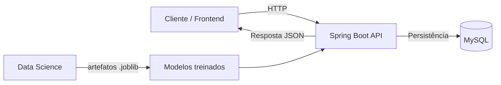

# 📊 Smart Finance - Análise de Comportamento Financeiro

Bem-vindo ao repositório do projeto Smart Finance, uma solução de análise financeira desenvolvida para o hackathon. O objetivo principal é entender o comportamento financeiro do usuário, classificar despesas, identificar o perfil financeiro e gerar recomendações personalizadas.

## 🧭 Visão geral do fluxo

A arquitetura do projeto foi pensada com uma divisão clara de responsabilidades:

- O módulo de Ciência de Dados treina os modelos, valida o desempenho e entrega artefatos serializados em formato .joblib.
- O backend é responsável por receber os dados do usuário, carregar esses modelos, executar a inferência e retornar a resposta em formato JSON.
- A persistência e a camada de API ficam no backend, enquanto a modelagem preditiva fica concentrada no módulo de dados.

```text
[ data-science ]  -> treina modelos e gera artefatos .joblib
        |
        v
[ backend ]       -> carrega os modelos e executa inferência
        |
        v
[ Spring Boot API + MySQL ]
```

---

## 🏗️ Arquitetura do sistema



### Componentes

1. Backend
   - API REST em Java 17 com Spring Boot.
   - Responsável por autenticação, validação, regras de negócio e integração com os modelos.
   - Já conta com estrutura inicial para cadastro/login e configuração com MySQL e JWT.

2. Data Science
   - Pipeline em Python para pré-processamento, engenharia de atributos, treino e avaliação de modelos.
   - Gera artefatos serializados em .joblib para posterior uso pelo backend.
   - O foco principal é classificar categorias de gasto e inferir o perfil financeiro do usuário.

3. Infraestrutura
   - Docker Compose para subir o banco de dados MySQL.
   - Organização em módulos para facilitar a execução do hackathon e a integração entre time de dados e backend.

---

## 📁 Estrutura do repositório

```bash
G9-HACKATHON-TEST/
├── backend/            # API Spring Boot, DTOs, controllers, serviços e integração com os modelos
├── data-science/       # Pipeline de ML, documentação e artefatos de treinamento
├── docker/             # Documentação e recursos auxiliares de infraestrutura
├── docs/               # Planejamento, metas e especificação de endpoints
└── README.md           # Visão geral do projeto
```

---

## 🔍 Status atual do projeto

O repositório já apresenta uma base inicial bem organizada:

- O backend possui estrutura Spring Boot com autenticação, configuração de banco e dependências para validação e segurança.
- O módulo de dados já documenta a lógica de treino, feature engineering e serialização de modelos.
- A integração entre os dois módulos ainda deve ser finalizada com a entrega dos artefatos .joblib e a carga desses modelos no backend.

Esse alinhamento é essencial para o MVP: a Ciência de Dados entrega o modelo; o Backend o consome para gerar a análise financeira em tempo real.

---

## 🚀 Como executar

### Requisitos prévios

- Docker e Docker Compose
- Java 17
- Maven 3.x
- Python 3.10+

### 1. Subir o banco de dados

No diretório do backend, execute:

```bash
cd backend
docker compose up -d
```

### 2. Rodar o backend

```bash
cd backend
mvn clean spring-boot:run
```

### 3. Trabalhar no módulo de dados

Consulte a documentação do módulo de ciência de dados em [data-science/README.md](data-science/README.md) para acompanhar o treinamento dos modelos e a geração dos artefatos.

---

## 🔗 Contrato principal da API

O endpoint principal do MVP é o fluxo de análise financeira:

### POST /analise-financeira

Entrada esperada:

```json
{
  "renda_mensal": 4500,
  "nivel_endividamento": 25,
  "frequencia_poupanca": "Media",
  "transacoes": [
    { "descricao": "Supermercado", "valor": 420 },
    { "descricao": "Combustivel", "valor": 300 },
    { "descricao": "Streaming", "valor": 40 }
  ]
}
```

Saída esperada:

```json
{
  "perfil_financeiro": "Em observacao",
  "probabilidade": 0.82,
  "resumo_gastos": {
    "alimentacao": 420,
    "transporte": 300,
    "entretenimento": 40
  },
  "recomendacoes": [
    "Monitorar gastos recorrentes de entretenimento",
    "Aumentar reserva financeira mensal"
  ]
}
```

---

## ☁️ Integração com OCI

Como parte do requisito do hackathon, o projeto deve contemplar integração com OCI, especialmente para:

- versionamento e armazenamento seguro dos modelos .joblib;
- possível persistência de relatórios ou artefatos gerados;
- futura disponibilização de pipelines e artefatos em ambiente externo.

---

## 📚 Documentação complementar

- [docs/METAS.md](docs/METAS.md)
- [docs/PLANO-ENDPOINTS.md](docs/PLANO-ENDPOINTS.md)
- [backend/README.md](backend/README.md)
- [data-science/README.md](data-science/README.md)
