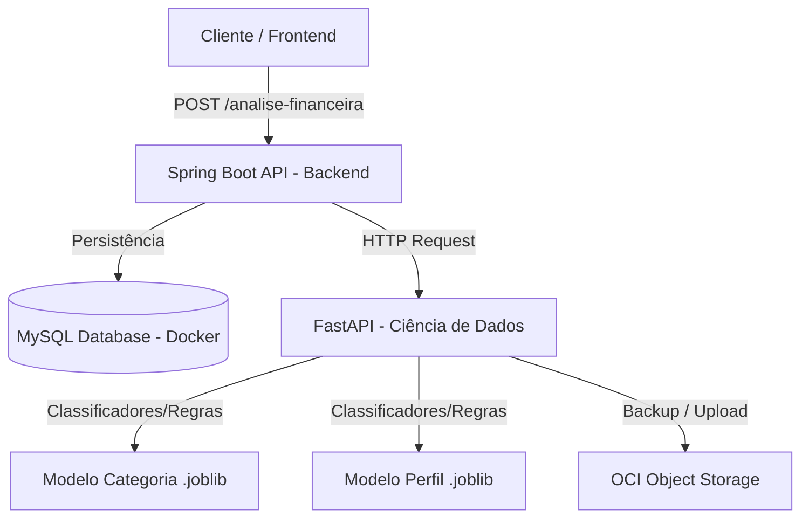

# 📊 Smart Finance - Análise de Comportamento Financeiro (G9 Hackathon)

Bem-vindo ao repositório do projeto **Smart Finance**, uma plataforma de análise de comportamento financeiro desenvolvida no contexto do Hackathon. O sistema analisa receitas, nível de endividamento, frequência de poupança e histórico de transações de usuários para classificar despesas, mapear perfis financeiros (Saudável, Em Observação ou Em Risco) e gerar recomendações inteligentes e personalizadas.

## Lógica do sistema

```text
[ data-science ]  ->  treina modelos e gera artefatos
        |
        v
[ backend/src/main/resources/models ]
        |
        v
[ backend Java ]  -> usa os artefatos para inferência via API
```

---

## 🏗️ Arquitetura do Sistema

O projeto é dividido em três grandes blocos estruturais que trabalham de forma coordenada:



1. **Backend (`/backend`)**: API REST construída com **Spring Boot 3.x** e **Java 17**, responsável pelas regras de negócio, persistência de transações e integração com o motor de Machine Learning.
2. **Ciência de Dados (`/data-science`)**: Pipeline em **Python** focado em Engenharia de Atributos, Treinamento de Modelos de Classificação (TF-IDF + Naive Bayes/SVM e Random Forest/Logistic Regression) e API de inferência com **FastAPI**.
3. **Infraestrutura (`/docker`)**: Orquestração e persistência de dados via **Docker Compose**, provendo um ambiente isolado para o banco de dados **MySQL 8.0**.

---

## 📁 Estrutura de Diretórios

```bash
G9-HACKATHON-TEST/
├── backend/            # Código-fonte da API Spring Boot e configurações do Maven
├── data-science/       # Modelos de Machine Learning, scripts de treinamento e API FastAPI
├── docker/             # Arquivos auxiliares e scripts para execução no Docker
├── docs/               # Documentações técnicas adicionais
├── docker-compose.yml  # Configuração global de serviços (MySQL)
└── STEPS.md            # Planejamento detalhado do Hackathon
```

---

## 🚀 Como Iniciar

### Requisitos Prévios
- [Docker](https://www.docker.com/) e Docker Compose instalados
- [Java JDK 17](https://www.oracle.com/java/technologies/downloads/) instalado
- [Maven 3.x](https://maven.apache.org/) instalado
- [Python 3.10+](https://www.python.org/) instalado

### Passo 1: Inicializar o Banco de Dados
Na raiz do projeto, execute o Docker Compose para subir a instância do MySQL:
```bash
docker compose up -d
```
*Consulte o [docker/README.md](file:///c:/Users/Admin/Documents/projetos/G9-HACKATHON-TEST/docker/README.md) para mais detalhes sobre credenciais e portas.*

### Passo 2: Executar o Backend
Acesse a pasta `backend`, instale as dependências Maven e inicie o Spring Boot:
```bash
cd backend
mvn clean spring-boot:run
```
*Consulte o [backend/README.md](file:///c:/Users/Admin/Documents/projetos/G9-HACKATHON-TEST/backend/README.md) para ver a documentação dos endpoints e Swagger.*

### Passo 3: Configurar o Módulo de Ciência de Dados
Acesse o diretório `data-science` para consultar a documentação de modelagem, pré-processamento e FastAPI.
*Consulte o [data-science/README.md](file:///c:/Users/Admin/Documents/projetos/G9-HACKATHON-TEST/data-science/README.md).*

---

## 🔗 Contrato da API Principal

### `POST /analise-financeira`

**Payload de Entrada (JSON)**
```json
{
  "renda_mensal": 4500,
  "nivel_endividamento": 25,
  "frequencia_poupanca": "Media",
  "transacoes": [
    { "descricao": "Supermercado", "valor": 420 },
    { "descricao": "Combustivel", "valor": 300 },
    { "descricao": "Streaming", "valor": 40 }
  ]
}
```

**Payload de Saída (JSON)**
```json
{
  "perfil_financeiro": "Em observacao",
  "probabilidade": 0.82,
  "resumo_gastos": {
    "alimentacao": 420,
    "transporte": 300,
    "entretenimento": 40
  },
  "recomendacoes": [
    "Monitorar gastos recorrentes de entretenimento",
    "Aumentar reserva financeira mensal"
  ]
}
```

---

## ☁️ Integração OCI (Oracle Cloud Infrastructure)
Como requisito obrigatório do hackathon, o projeto fará uso de:
- **OCI Object Storage**: Armazenamento seguro e versionado dos arquivos serializados de modelos (`.joblib`) e relatórios periódicos em PDF dos usuários.
