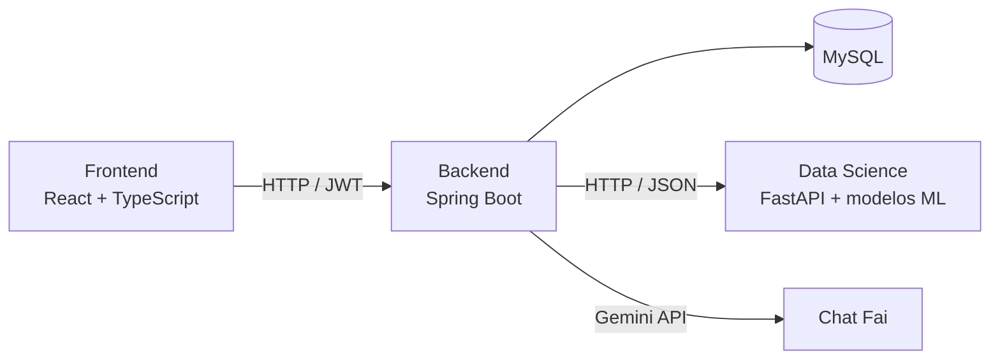

# FinanceAI

Plataforma web para controle de transações, análise financeira e recomendações personalizadas. O projeto reúne um frontend React, uma API Spring Boot, um serviço de ciência de dados em FastAPI, MySQL e um assistente de IA generativa (Fai) integrado via Gemini.


## Sumário

- [Arquitetura](#arquitetura)
- [Tecnologias](#tecnologias)
- [Funcionalidades](#funcionalidades)
- [Equipe de Backend](#equipe-de-backend)
- [Equipe de Data Science](#equipe-de-data-science)
- [Endpoints principais do backend](#endpoints-principais-do-backend)
- [Documentação complementar](#documentação-complementar)

## Arquitetura


```mermaid
flowchart LR
  FE["Frontend\nReact + TypeScript"] -->|"HTTP / JWT"| BE["Backend\nSpring Boot"]
  BE --> DB[("MySQL")]
  BE -->|"HTTP / JSON"| DS["Data Science\nFastAPI + modelos ML"]
  BE -->|"Gemini API"| FAI["Chat Fai"]
```

| Componente | Diretório | Responsabilidade |
|---|---|---|
| Frontend | `frontend/` | Interface web e consumo da API. |
| Backend | `backend/` | Autenticação JWT, regras de negócio, persistência, integrações com IA e Fai. |
| Data Science | `data-science/` | Modelos de classificação/análise e API FastAPI. |
| Infraestrutura | `docker/` e `backend/docker-compose.yml` | Documentação e execução containerizada do backend com MySQL. |

> A comunicação com a API Gemini acontece **exclusivamente pelo backend**: o frontend nunca tem acesso à chave nem chama a IA generativa diretamente, o que evita exposição de credenciais no cliente.

## Tecnologias

- **Frontend:**   
- **Backend:**    (JWT)
- **Data Science:**   Pandas, Scikit-Learn
- **Banco de dados:** 
- **IA generativa:** 
- **Infraestrutura:** 

## Funcionalidades

- Cadastro e login com JWT.
- CRUD e importação em lote de transações.
- Classificação de transações e análise financeira via serviço de ciência de dados.
- Metas financeiras, relatórios e simulação de quitação.
- Chat Fai, assistente de finanças pessoais integrado à API Gemini, restrito ao escopo financeiro do usuário autenticado.

## Equipe de Backend

A equipe de Backend é responsável pela API REST do projeto, que centraliza o gerenciamento de dados de usuários e transações, orquestra a lógica de análise financeira e faz a comunicação com o serviço de Ciência de Dados e com a API do Gemini (Chat Fai).

A aplicação foi construída em **Java 17** com **Spring Boot 3.3.1**, utilizando:

- **Spring Web** — criação dos endpoints RESTful.
- **Spring Data JPA** — abstração de banco de dados e persistência ORM.
- **MySQL Connector/J** — driver de conexão com o MySQL.
- **Spring Boot Starter Validation** — validação sintática de payloads via Bean Validation.
- **Lombok** — geração automática de getters, setters, construtores e builders.
- **Springdoc OpenAPI** — documentação Swagger UI gerada automaticamente.
- **ModelMapper** — conversão entre entidades JPA e DTOs.

A organização do código segue o padrão em camadas do ecossistema Spring:

```
com.hackathon.one/
├── FinanceApplication.java    # Classe principal de inicialização
├── controller/                # Exposição de endpoints REST (REST Controllers)
├── service/                   # Camada de lógica de negócio e regras do sistema
├── repository/                # Interfaces de comunicação com o MySQL (JPA Repositories)
├── model/                     # Entidades persistentes (Usuario, Transacao, etc.)
├── dto/                       # Objetos de Transferência de Dados (Requests/Responses)
├── exception/                 # Tratamento global de erros (@ControllerAdvice)
└── config/                    # Configurações do Spring (Swagger, ModelMapper, etc.)
```

As configurações de ambiente são organizadas por perfis (`application-dev.yml` para desenvolvimento local e `application-docker.yml` para execução em container), separando os parâmetros de conexão com o MySQL, JPA/Hibernate e demais integrações por contexto de execução.

## Equipe de Data Science

A equipe de Data Science é responsável por treinar, avaliar e serializar os modelos de Machine Learning consumidos pelo backend, além de expô-los através de um serviço próprio em FastAPI.

### Modelos desenvolvidos

| Modelo | Objetivo | Algoritmo | Artefatos gerados |
|---|---|---|---|
| Modelo 1 — Categoria | Classificar a categoria de uma transação a partir da descrição textual (ex: "Uber" → Transporte) | TF-IDF + Multinomial Naive Bayes | `modelo_categoria.joblib`, `tfidf.joblib` |
| Modelo 2 — Perfil Financeiro | Classificar o perfil financeiro do usuário (Saudável / Em observação / Em risco) a partir de dados socioeconômicos e financeiros | One-Hot Encoding + Random Forest (via Pipeline) | `modelo_perfil.joblib`, `feature_importance.csv` |

### Pipeline de trabalho

1. `data/eda.ipynb` — exploração inicial e verificação de qualidade dos dados brutos.
2. `notebooks/sandbox/TratamentoVariaveis.ipynb` — limpeza e tratamento de tipos/inconsistências.
3. `notebooks/sandbox/EngenhariaAtributos.ipynb` — criação de atributos derivados e geração dos datasets prontos para treino.
4. `notebooks/training/TreinamentoCategoria.ipynb` — treino, avaliação e serialização do Modelo 1.
5. `notebooks/training/TreinamentoPerfil.ipynb` — treino, avaliação e serialização do Modelo 2.
6. `api/scripts/predictor.py` — carrega os artefatos de `models/` e expõe as funções de predição consumidas pela API FastAPI.

```bash
cd data-science/api
pip install -r ../requirements.txt
uvicorn main:app --reload --port 8000
```

### 3. Executar o Backend Spring Boot

```bash
cd backend
mvn clean spring-boot:run
```

- **Modelo 1 (Categoria):** Accuracy ≈ 98,4% · F1-macro ≈ 98,4% (validação cruzada: F1-macro médio ≈ 98,1%, desvio padrão ≈ 0,001).
- **Modelo 2 (Perfil Financeiro):** Accuracy ≈ 100% · F1-macro ≈ 100%.

> **Nota de transparência sobre o Modelo 2:** as variáveis mais relevantes identificadas (`nivel_endividamento`, `score_credito`, `percentual_renda_investida`) são as mesmas utilizadas na definição original do rótulo `perfil_financeiro` no dataset sintético. Ou seja, o modelo reproduz com alta fidelidade a lógica de negócio que já originou o rótulo, e não necessariamente descobre um padrão novo e independente — comportamento esperado dado como o dataset foi construído, e registrado aqui como limitação do experimento, não como falha do pipeline.

## Endpoints principais do backend

| Método | Endpoint | Descrição |
|---|---|---|
| `POST` | `/auth/signup` | Cria uma conta. |
| `POST` | `/auth/login` | Autentica e retorna JWT. |
| `GET/POST/PUT/DELETE` | `/transacoes` | Gerencia transações. |
| `POST` | `/transacoes/lote` | Importa transações em lote. |
| `POST` | `/transacoes/classificar` | Classifica uma transação pelo serviço de IA. |
| `POST` | `/analise-financeira` | Gera análise financeira. |
| `GET` | `/analise-financeira/historico` | Consulta o histórico de análises. |
| `GET` | `/analise-financeira/evolucao` | Consulta a evolução financeira. |
| `POST` | `/fai/chat` | Conversa com a Fai. |
| `GET/POST` | `/metas` | Consulta e cria metas financeiras. |
| `POST` | `/simulacao/quitacao` | Simula quitação de dívida. |
| `GET` | `/usuarios/me` | Consulta o perfil autenticado. |

Rotas, payloads e respostas detalhados estão documentados via Swagger/OpenAPI, gerado automaticamente pelo Springdoc a partir dos controllers do backend.

## Documentação complementar

- [SETUP.md](SETUP.md): preparação do ambiente backend.
- [backend/README.md](backend/README.md): documentação específica da API Java.
- [frontend/README.md](frontend/README.md): documentação do cliente web.
- [data-science/README.md](data-science/README.md): serviço e modelos de ciência de dados.
- [docker/README.md](docker/README.md): imagens e Compose.