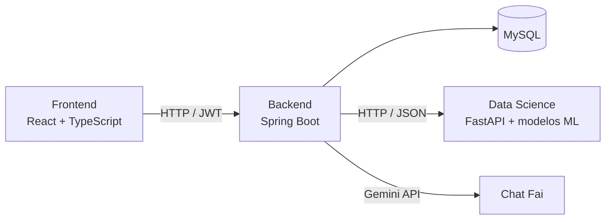

# FinanceAI

Plataforma web para controle de transações, análise financeira e recomendações personalizadas. O projeto reúne um frontend React, uma API Spring Boot, um serviço de ciência de dados em FastAPI, MySQL e um assistente de IA generativa (Fai) integrado via Gemini.

## Sumário

- [Arquitetura](#arquitetura)
- [Tecnologias](#tecnologias)
- [Funcionalidades](#funcionalidades)
- [Pré-requisitos](#pré-requisitos)
- [Execução local](#execução-local)
- [Variáveis de ambiente](#variáveis-de-ambiente)
- [Endpoints principais do backend](#endpoints-principais-do-backend)
- [Docker](#docker)
- [Solução de problemas](#solução-de-problemas)
- [Documentação complementar](#documentação-complementar)

## Tecnologias
 
- **Frontend:**   
- **Backend:**    (JWT)
- **Data Science:**   Pandas, Scikit-Learn
- **Banco de dados:** 
- **IA generativa:** 
- **Infraestrutura:** 

## Arquitetura


```mermaid
flowchart LR
  FE["Frontend\nReact + TypeScript"] -->|"HTTP / JWT"| BE["Backend\nSpring Boot"]
  BE --> DB[("MySQL")]
  BE -->|"HTTP / JSON"| DS["Data Science\nFastAPI + modelos ML"]
  BE -->|"Gemini API"| FAI["Chat Fai"]
```

| Componente | Diretório | Responsabilidade |
|---|---|---|
| Frontend | `frontend/` | Interface web e consumo da API. |
| Backend | `backend/` | Autenticação JWT, regras de negócio, persistência, integrações com IA e Fai. |
| Data Science | `data-science/` | Modelos de classificação/análise e API FastAPI. |
| Infraestrutura | `docker/` e `backend/docker-compose.yml` | Documentação e execução containerizada do backend com MySQL. |

> A comunicação com a API Gemini acontece **exclusivamente pelo backend**: o frontend nunca tem acesso à chave nem chama a IA generativa diretamente, o que evita exposição de credenciais no cliente.


## Funcionalidades

- Cadastro e login com JWT.
- CRUD e importação em lote de transações.
- Classificação de transações e análise financeira via serviço de ciência de dados.
- Metas financeiras, relatórios e simulação de quitação.
- Chat Fai, assistente de finanças pessoais integrado à API Gemini, restrito ao escopo financeiro do usuário autenticado.

## Pré-requisitos

- Java 17 e Maven 3.9+
- Node.js 20+ e npm
- Python 3.11+ (para o serviço de Data Science)
- Docker Desktop (MySQL e execução containerizada)
- Uma chave de API do [Google Gemini](https://ai.google.dev/) válida (necessária apenas para usar o Chat Fai)

## Execução local

### 1. Backend e MySQL

Crie `backend/.env` a partir do exemplo abaixo. **O arquivo não deve ser versionado.**

```env
GEMINI_API_KEY=sua_chave_gemini
# Opcional: URL/token do serviço de ciência de dados
DATASCIENCE_API_URL=http://localhost:7070
DATASCIENCE_API_TOKEN=token-nao-configurado
```

Suba o banco e inicie a API:

```bash
cd backend
docker compose up -d mysql
mvn spring-boot:run
```

- API: `http://localhost:8080`
- Swagger: `http://localhost:8080/swagger-ui/index.html`

> Sem `GEMINI_API_KEY` configurada, a API continua ativa normalmente, mas o endpoint `/fai/chat` responde `503 Service Unavailable`, seguindo o formato padrão de erro da API (veja [Solução de problemas](#solução-de-problemas)).

### 2. Serviço de Data Science

```bash
cd data-science/api
python -m venv .venv

# Windows PowerShell
.\.venv\Scripts\Activate.ps1
# Linux/macOS
source .venv/bin/activate

pip install -r ../requirements.txt
uvicorn main:app --reload --port 7070
```

Consulte [data-science/README.md](data-science/README.md) para variáveis e contratos específicos do serviço.

### 3. Frontend

```bash
cd frontend
cp .env.example .env
npm install
npm run dev
```

Aplicação: `http://localhost:3000`

## Variáveis de ambiente

| Variável | Local | Obrigatória | Descrição |
|---|---|---|---|
| `GEMINI_API_KEY` | `backend/.env` | Apenas para o Chat Fai | Chave de acesso à API do Google Gemini. Sem ela, o restante da API funciona normalmente; apenas `/fai/chat` fica indisponível. |
| `DATASCIENCE_API_URL` | `backend/.env` | Não (tem valor padrão) | URL do serviço FastAPI de ciência de dados. |
| `DATASCIENCE_API_TOKEN` | `backend/.env` | Não (tem valor padrão) | Token de autenticação entre o backend e o serviço de Data Science. |

## Endpoints principais do backend

| Método | Endpoint | Descrição |
|---|---|---|
| `POST` | `/auth/signup` | Cria uma conta. |
| `POST` | `/auth/login` | Autentica e retorna JWT. |
| `GET/POST/PUT/DELETE` | `/transacoes` | Gerencia transações. |
| `POST` | `/transacoes/lote` | Importa transações em lote. |
| `POST` | `/transacoes/classificar` | Classifica uma transação pelo serviço de IA. |
| `POST` | `/analise-financeira` | Gera análise financeira. |
| `GET` | `/analise-financeira/historico` | Consulta o histórico de análises. |
| `GET` | `/analise-financeira/evolucao` | Consulta a evolução financeira. |
| `POST` | `/fai/chat` | Conversa com a Fai. |
| `GET/POST` | `/metas` | Consulta e cria metas financeiras. |
| `POST` | `/simulacao/quitacao` | Simula quitação de dívida. |
| `GET` | `/usuarios/me` | Consulta o perfil autenticado. |

Rotas, payloads e respostas detalhados estão disponíveis no Swagger quando o backend estiver em execução.

## Docker

O projeto possui dois Dockerfiles, um por serviço executável: [backend/Dockerfile](backend/Dockerfile) e [data-science/Dockerfile](data-science/Dockerfile). A explicação, comandos e limitações atuais estão em [docker/README.md](docker/README.md).

Para subir backend e MySQL em contêineres:

```bash
cd backend
docker compose up -d --build
```

## Solução de problemas

| Sintoma | Causa provável | O que fazer |
|---|---|---|
| `/fai/chat` retorna `503 Service Unavailable` | `GEMINI_API_KEY` ausente ou inválida em `backend/.env` | Configure a variável e reinicie o backend. |
| Frontend redireciona sempre para login | Token JWT ausente, inválido ou expirado | Faça login novamente; verifique se o token está sendo salvo/enviado corretamente. |
| Erro de conexão com `/transacoes/classificar` ou análise financeira | Serviço de Data Science (FastAPI) fora do ar | Confirme se `uvicorn` está rodando em `http://localhost:7070` e se `DATASCIENCE_API_URL` aponta para o endereço correto. |
| Backend não sobe / erro de conexão com o MySQL | Container do MySQL não iniciado | Rode `docker compose up -d mysql` antes de `mvn spring-boot:run`. |

## Documentação complementar

- [SETUP.md](SETUP.md): preparação do ambiente backend.
- [backend/README.md](backend/README.md): documentação específica da API Java.
- [frontend/README.md](frontend/README.md): documentação do cliente web.
- [data-science/README.md](data-science/README.md): serviço e modelos de ciência de dados.
- [docker/README.md](docker/README.md): imagens e Compose.