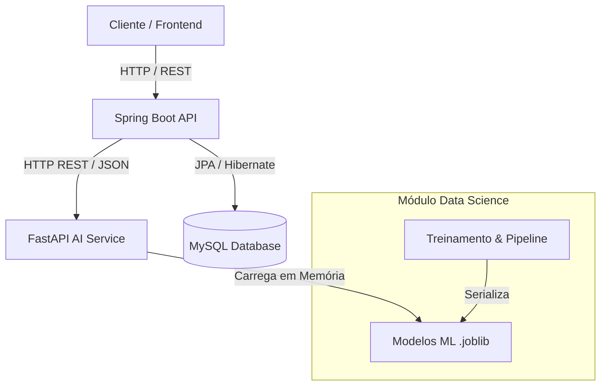

# 📊 Smart Finance - Análise de Comportamento Financeiro

Bem-vindo ao repositório do projeto **Smart Finance**, uma solução de análise e saúde financeira desenvolvida para o hackathon. O objetivo principal é compreender o comportamento financeiro do usuário, classificar automaticamente despesas por meio de Inteligência Artificial, determinar seu perfil de risco/saúde financeira e gerar recomendações personalizadas.

---

## 🧭 Visão geral do fluxo de arquitetura

A arquitetura do projeto foi reformulada para utilizar uma **API REST dedicada em FastAPI (Python)** responsável por servir os modelos de Inteligência Artificial. O **Spring Boot (Java)** atua como o backend central de negócio, orquestrando as chamadas HTTP para o microserviço FastAPI.

```text
┌──────────────────┐       HTTP       ┌─────────────────────┐       HTTP       ┌────────────────────────┐
│ Cliente / Front  │ ────────────────> │  Backend Spring     │ ────────────────> │  API IA FastAPI        │
│                  │ <──────────────── │  Boot + MySQL       │ <──────────────── │  (Serviço Python/ML)   │
└──────────────────┘                   └─────────────────────┘                  └────────────────────────┘
                                                                                            │
                                                                                            ▼
                                                                                  ┌──────────────────┐
                                                                                  │ Modelos ML       │
                                                                                  │ (.joblib)        │
                                                                                  └──────────────────┘
```

---

## 🏗️ Arquitetura do Sistema


```mermaid
graph TD
    Client[Cliente / Frontend] -->|HTTP / REST| Spring[Spring Boot API]
    Spring -->|JPA / Hibernate| DB[(MySQL Database)]
    Spring -->|HTTP REST / JSON| FastAPI[FastAPI AI Service]
    FastAPI -->|Carrega em Memória| ML[Modelos ML .joblib]

    subgraph "Módulo Data Science"
        DS[Treinamento & Pipeline] -->|Serializa| ML
    end
```

### Componentes principais

1. **Backend Core (Spring Boot - Java 17)**
   - Gerencia autenticação JWT, usuários, persistência de transações e histórico de análises no MySQL.
   - Consome a API FastAPI para solicitar classificações de gastos e análises de perfil financeiro.

2. **Microserviço de IA (FastAPI - Python 3.10+)**
   - Expõe endpoints REST de alta performance para inferência em tempo real.
   - Carrega os modelos de Machine Learning serializados (`.joblib`).

3. **Módulo de Data Science (Python)**
   - Treinamento dos modelos de IA, feature engineering e geração dos artefatos `.joblib`.
   - Modelo 1: Classificador de categorias de despesas (TF-IDF + Classificador).
   - Modelo 2: Classificador de perfil financeiro e motor de recomendações.

---

## 📌 Tabela de Endpoints da Aplicação

### 🌐 Endpoints do Backend Core (Spring Boot)

| Método | Endpoint | Protegido | Descrição |
| :--- | :--- | :---: | :--- |
| `POST` | `/auth/signup` | ❌ | Cadastra um novo usuário no sistema. |
| `POST` | `/auth/login` | ❌ | Autentica o usuário e retorna o token JWT. |
| `POST` | `/transacoes` | 🔐 | Cria uma nova transação para o usuário autenticado. |
| `GET` | `/transacoes` | 🔐 | Lista as transações do usuário autenticado. |
| `PUT` | `/transacoes/{id}` | 🔐 | Atualiza uma transação existente. |
| `DELETE` | `/transacoes/{id}` | 🔐 | Remove uma transação do usuário. |
| `POST` | `/transacoes/classificar` | 🔐 | Envia transação para o FastAPI e devolve a categoria classificada por IA. |
| `POST` | `/analise-financeira` | 🔐 | Agrega histórico/dados do usuário, consulta FastAPI e gera perfil + recomendações. |
| `GET` | `/analise-financeira/historico` | 🔐 | Lista todas as análises efetuadas pelo usuário. |
| `GET` | `/analise-financeira/{id}` | 🔐 | Exibe os detalhes de uma análise específica do usuário. |

---

### 🤖 Endpoints do Microserviço de IA (FastAPI)

| Método | Endpoint | Consumido Por | Descrição |
| :--- | :--- | :--- | :--- |
| `POST` | `/classificar` | Backend Spring | Recebe a descrição/valor da transação e retorna a categoria predita e a confiança da IA. |
| `POST` | `/analise-financeira` | Backend Spring | Recebe a renda, endividamento, poupança e resumo de gastos para retornar perfil e recomendações. |
| `GET` | `/health` | Infra/Spring | Endpoint de verificação de integridade do microserviço FastAPI. |

---

## 🤖 Lógica da Documentação de Data Science & Treinamento

O modelo de Inteligência Artificial é treinado especificamente para responder aos dois contratos de inferência utilizados pelo backend Spring Boot:

### 1. Classificação de Categorias (`/classificar`)
- **Alvo do Modelo**: Classificar uma string descritiva (ex: *"Uber Trip"*, *"Supermercado XYZ"*) nas categorias padrão: `alimentacao`, `transporte`, `moradia`, `saude`, `educacao`, `lazer`, `servicos`, `outros`.
- **Técnica**: Vetorização de texto (**TF-IDF**) + Algoritmo Classificador (**Logistic Regression** / **MultinomialNB** / **SVM**).

### 2. Análise de Perfil Financeiro e Recomendações (`/analise-financeira`)
- **Alvo do Modelo**: Classificar o comportamento financeiro do usuário entre as categorias de perfil:
  - `Saudavel`: Baixo endividamento, boa taxa de poupança e distribuição equilibrada de gastos.
  - `Em observacao`: Comprometimento moderado da renda ou concentração elevada em gastos supérfluos.
  - `Em risco`: Alto endividamento, baixa/nenhuma poupança e despesas essenciais/supérfluas comprometendo o orçamento.
- **Técnica**: Algoritmo de classificação tabular (**Random Forest** / **Gradient Boosting**) sobre os dados declarativos agregados com métricas de despesas por categoria.

---

## 🔄 Fluxo Completo de Integração de Dados

### 🌟 Fluxo 1: Classificação de Transação (`/transacoes/classificar`)

```text
Entrada (Spring Request)           FastAPI /classificar              Modelo IA (.joblib)                Saída (Spring Response)
┌───────────────────────┐         ┌────────────────────┐            ┌──────────────────┐               ┌────────────────────────┐
│ {                     │  HTTP   │ {                  │  predict() │ {                │  JSON Response│ {                      │
│   "descricao":        │ ──────> │   "descricao":     │ ─────────> │   "categoria":   │ ────────────> │   "categoria":         │
│     "Ifood Burger",   │  POST   │     "Ifood Burger",│            │     "alimentacao"│               │     "alimentacao"      │
│   "valor": 45.90      │         │   "valor": 45.90   │            │ }                │               │ }                      │
│ }                     │         │ }                  │            └──────────────────┘               └────────────────────────┘
└───────────────────────┘         └────────────────────┘
```

---

### 🌟 Fluxo 2: Análise Financeira Completa (`/analise-financeira`)

```text
Entrada (Spring Request)               Spring Boot Backend                   FastAPI /analise-financeira            Modelo IA + FastAPI Response           Saída Final (Spring)
┌────────────────────────────┐         ┌──────────────────────────────┐     ┌────────────────────────────────┐     ┌────────────────────────────────┐     ┌────────────────────────────┐
│ {                          │  HTTP   │ 1. Busca transações do       │ HTTP│ {                              │     │ {                              │     │ {                          │
│   "rendaMensal": 4500.0,   │ ──────> │    usuário no MySQL.        │POST │   "renda_mensal": 4500.0,      │────>│   "perfil_financeiro":         │────>│   "perfil_financeiro":     │
│   "nivelEndividamento": 25,│  POST   │ 2. Agrega despesas por       │────>│   "nivel_endividamento": 25.0, │     │     "Em observacao",           │     │     "Em observacao",       │
│   "frequenciaPoupanca":    │         │    categoria.                │     │   "frequencia_poupanca":       │     │   "probabilidade": 0.82,       │     │   "probabilidade": 0.82,   │
│     "Media"                │         │ 3. Monta payload para        │     │     "Media",                   │     │   "resumo_gastos": { ... },    │     │   "resumo_gastos": { ... },│
│ }                          │         │    o FastAPI.                │     │   "gasto_alimentacao": 420.0,  │     │   "recomendacoes": [           │     │   "recomendacoes": [       │
└────────────────────────────┘         └──────────────────────────────┘     │   "gasto_transporte": 300.0,   │     │     "Monitorar gastos..."      │     │     "Monitorar gastos..."  │
                                                                            │   "gasto_lazer": 40.0          │     │   ]                            │     │   ]                        │
                                                                            │ }                              │     │ }                              │     │ }                          │
                                                                            └────────────────────────────────┘     └────────────────────────────────┘     └────────────────────────────┘
```

---

## 📁 Estrutura do repositório

```bash
G9-HACKATHON-TEST/
├── backend/            # API Spring Boot (Java 17, Spring Security, JPA, MySQL)
├── data-science/       # Pipeline de ML, treinamento de modelos e API FastAPI
├── docker/             # Scripts e arquivos de infraestrutura (Docker Compose, MySQL)
├── docs/               # Planejamento, especificações e metas do hackathon
└── README.md           # Visão geral do repositório
```

---

## 🚀 Como Executar

### 1. Subir o Banco de Dados (MySQL)

```bash
cd backend
docker compose up -d
```

### 2. Executar a API FastAPI de Inteligência Artificial

```bash
cd data-science/api
pip install -r ../requirements.txt
uvicorn main:app --reload --port 8000
```

### 3. Executar o Backend Spring Boot

```bash
cd backend
mvn clean spring-boot:run
```

---

## ☁️ Integração com OCI (Oracle Cloud Infrastructure)

- Versionamento e armazenamento dos artefatos `.joblib` em buckets no OCI Object Storage.
- Download automático das versões mais recentes dos modelos na inicialização do serviço FastAPI.
- Persistência e exportação de relatórios para inteligência de dados na nuvem.

---

## 📚 Documentação Complementar

- [docs/METAS.md](docs/METAS.md)
- [docs/PLANO-ENDPOINTS.md](docs/PLANO-ENDPOINTS.md)
- [backend/README.md](backend/README.md)
- [data-science/README.md](data-science/README.md)
- [data-science/FLUXO.md](data-science/FLUXO.md)
- [data-science/PLANOS.md](data-science/PLANOS.md)

