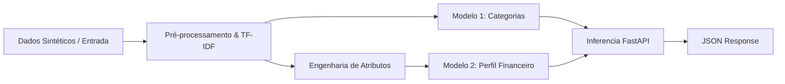

# 📊 Smart Finance - Ciência de Dados (ML Pipeline)

`Esta parte é uma descrição de como será o projeto mas o líder de dados Thiago deverá confirmar se seguirá esta lógica ` 

Este diretório contém o planejamento e a documentação para o módulo de **Ciência de Dados** do projeto Smart Finance. O objetivo deste módulo é classificar despesas a partir de descrições textuais, identificar perfis financeiros com base no comportamento de gastos e fornecer recomendações automatizadas personalizadas.

---

## 🏗️ Desenho do Pipeline de Machine Learning

O fluxo de dados e modelagem é planejado em 5 macro-etapas:



### 1. Modelagem do Dataset (Sintético)
Será construído um dataset simulando comportamentos de usuários:
*   **Campos de Transações**: `descricao` (ex: "Supermercado Compre Bem", "Posto Ipiranga"), `valor` (float).
*   **Campos de Perfil do Usuário**: `renda_mensal` (float), `nivel_endividamento` (% da renda comprometida com dívidas), `frequencia_poupanca` (Baixa/Média/Alta).
*   **Classes de Perfil Financeiro (Target 2)**:
    *   `Saudavel`: Baixo endividamento, frequência de poupança Média/Alta, boa reserva.
    *   `Em observacao`: Endividamento moderado, poupança Média/Baixa, alguns gastos supérfluos.
    *   `Em risco`: Alto nível de endividamento, não poupa dinheiro, alto percentual de renda gasto em categorias não essenciais.

### 2. Engenharia de Atributos (Feature Engineering)
Serão criadas métricas derivadas a partir das transações agregadas por usuário para alimentar o classificador de perfil:
*   **Razão Gasto/Renda**: Somatório de despesas dividido por `renda_mensal`.
*   **Percentuais de Gastos por Categorias**: Proporção de despesas essenciais (ex: alimentação, saúde) vs. não essenciais (ex: entretenimento, lazer).
*   **Taxa de Endividamento Efetivo**: Cruzamento do endividamento autodeclarado com o perfil de faturamento e gasto atual.
*   **Encoding Categórico**: Transformação da `frequencia_poupanca` em valores ordinais (Baixa: 0, Média: 1, Alta: 2).

### 3. Modelagem e Algoritmos Propostos

#### Modelo 1: Classificador de Categoria de Despesas
*   **Objetivo**: Classificar a `descricao` da transação (ex: "McDonalds") em categorias (Alimentação, Transporte, Saúde, Lazer, etc.).
*   **Abordagem**: Pré-processamento de texto (remoção de acentos, letras minúsculas, stopwords) + Representação vetorial **TF-IDF** + Algoritmo **Naive Bayes (MultinomialNB)** ou **SVM (Support Vector Classifier)**.

#### Modelo 2: Classificador de Perfil Financeiro
*   **Objetivo**: Predizer a classe de risco do usuário (`Saudavel`, `Em observacao`, `Em risco`).
*   **Abordagem**: Algoritmo **Random Forest Classifier** ou **Regressão Logística**, gerando a probabilidade associada à classe predita (enviada no campo `probabilidade` do JSON).

---

## 🚀 Estrutura da API de Inferência (FastAPI)

Os modelos serializados via `joblib` serão expostos utilizando **FastAPI** por sua performance e facilidade na criação de documentação automática com OpenAPI/Swagger.

### Contrato de Dados Planejado (Pydantic Models)

```python
from pydantic import BaseModel
from typing import List

class TransacaoInput(BaseModel):
    descricao: str
    valor: float

class AnaliseInput(BaseModel):
    renda_mensal: float
    nivel_endividamento: float
    frequencia_poupanca: str  # "Baixa", "Media", "Alta"
    transacoes: List[TransacaoInput]

class ResumoGastos(BaseModel):
    alimentacao: float = 0.0
    transporte: float = 0.0
    entretenimento: float = 0.0
    outros: float = 0.0

class AnaliseOutput(BaseModel):
    perfil_financeiro: str  # "Saudavel", "Em observacao", "Em risco"
    probabilidade: float
    resumo_gastos: ResumoGastos
    recomendacoes: List[str]
```

### Lógica de Recomendações (Motor de Regras Associado)
Após a inferência dos modelos, um módulo auxiliar aplica regras de recomendação personalizadas:
*   *Se perfil == "Em risco"* ➔ Sugerir renegociação de dívidas e cortes em entretenimento.
*   *Se gasto com entretenimento > 20% da renda* ➔ Adicionar alerta de economia de gastos supérfluos.
*   *Se poupança == "Baixa"* ➔ Recomendar a criação de uma reserva de emergência equivalente a 3 meses de renda.

---

## ☁️ OCI Object Storage Integration

Para garantir conformidade com os requisitos da OCI, o pipeline automatizará:
1.  **Versionamento do Modelo**: Salvamento dos arquivos `.joblib` treinados no OCI Object Storage.
2.  **Download do Modelo**: A API FastAPI poderá baixar o modelo mais recente do Storage durante o bootstrapping da aplicação.
3.  **Logs de Inferência**: Envio de relatórios consolidados em formato CSV ou JSON contendo a distribuição dos perfis analisados.
